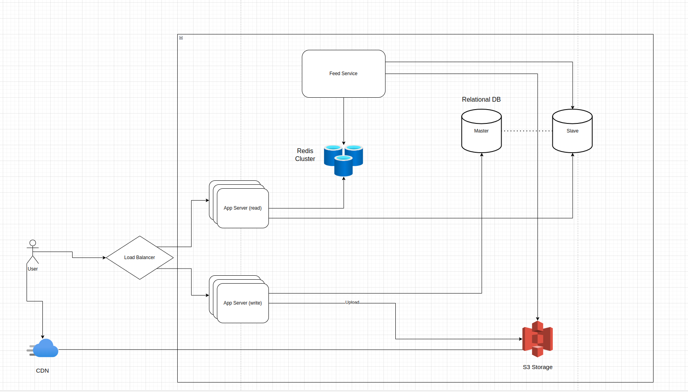

# projector-hsa-07

# Design Instagram.com news feed

## Step 1: Functional Requirements

**Image Upload**:

* **Users** should be able to upload images from theirs devices in different format and sizes;

**News Feed**:

* **System** should be able to generate a news feed of images and videos based on relevancy;

**Advanced**:

* **Users** can like some image/videos and receive notification about its likes;
* **Users** can should be able to follow other users and receive notification when they ar followed by others users;

## Step 2: Not-Functional Requirements

* **Reliable**
* **Scalable**
* **Available**
* **Resilient**
* **No SPOFs**

## Step 3: Back of the envelope calculation

1. *Storage capacity*:
   Assume that general image/videos size will be 10mb and average number of images will be uploaded per day is 5 units
   per user. Someone can upload more someone less.

   Assume we are going to support around 1 million of users.

   Storage per Day = 10^6 * 10mb = 10 terrabyte per day. -> 3.65 petabytes per year.

2. *Network bandwidth*:

## Step 4: High Level architecture

## Step 5: Design core concepts

1.We could use a relational database to store some user specific data or metadata. Relational database is the most
suitable here, we can use build in features like replication just from scratch. PostgreSQL/MySQL are ideal options
here. In our case simple database server can be SPOF, so to reach more system availability and mitigate the SPOF we
should use Master-Slave replication approach;

2.AWS S3 is ideal for storing images/videos in our case. S3 is designed to offers high durability, availability,
and performance object storage for frequently accessed data.Because it delivers low latency and high throughput, S3
Standard is appropriate for a wide variety of use cases.

Key features of S3:

* Low latency and high throughput performance;
* Designed for durability of 99.999999999% of objects across multiple Availability Zones
* Resilient against events that impact an entire Availability Zone
* Designed for 99.99% availability over a given year

That's why we can consider S3 as resilient part of the system;

3.To increase the system read performance its also required some caching layer. In our case we can use Redis store.
Redis has a lot of features that can be used in high load systems. For example, its very easy to reach high
availability using Redis Sentinel which monitor state of the master and perform a fail over in case of any issue with
it; To have more performant system we can use just a Redis cluster which is ideal for managing large datasets and
high throughput across multiple nodes;

4.Of course, a key part of our system are API web servers. API should process large number of request on write and read.
To escape situation when web server is a system bottleneck we should use Load Balancer as a API gateway which will
spread the load across multiple web servers. Also, its good to split the API to the read and write part, in such case we
will be able to independently tune our system depending on our needs(whether we want more read or write performance as
different approached should be used).

5. Because our system is related on serving a lot of video or image content. Its considered to be a good practice to use
   a content delivery network CDN. AWS CloudFront is a good choice here. CDN help to distribute a content faster to the
   client which reduce the latency and increase general system response time.

## Step 6: System architecture

